# 1. Dev Environment


!!! quote "By the end of this section you should have"

    - An Azure subscription provisioned with required resources
    - A GitHub Codespaces environment configured with env variables
    - Validated both with a set of simple checks

    - **DURATION:** 
        - 10 mins (In-Venue) - with pre-provisioned resources
        - 20 mins (Self-Guided) - to also provision resources

---

## Before You Begin

By now, you should be in the GitHub Codespaces environment - where you launched _this_ instruction guide in the browser. **You arrived here from one of the two paths below**:

1. You are a **Microsoft Build Attendee** - and followed the Skillable VM instructions.
1. You are a **Self-Guided Learner** - and followed the repo README instructions.

While the labs are identical, the setup steps for the two paths are different. Let's make sure you see the right instructions for your path.

!!! info "Pick the tab that represents your current path. This preference gets set site-wide."

    === "I AM A SESSION ATTENDEE"

        !!! quote "**Yes, I am currently at Microsoft Build, using the Skillable-provided Azure subscription**"

    === "I AM A SELF-GUIDED LEARNER"

        !!! quote "**Yes, I am working on this at home, using my own Azure subscription**"

---

## 1. Login with Azure CLI

!!! info "In this step, you'll log into Azure from GitHub Codespaces"

1. Switch to the GitHub Codespaces tab - open VS Code terminal
1. Run the following command - this uses the Azure CLI (`az`):

    ```bash title="" linenums="0"
    az login --use-device-code
    ```

1. Follow the terminal instructions to complete the authentication flow. When asked for Azure credentials, follow the instructions below.

    === "I AM A SESSION ATTENDEE"

        - [X] Visit the Skillable VM tab and look for the _Azure Credentials_ section
        - [X] Complete Azure auth flow using the _{username, password}_ provided

    === "I AM A SELF-GUIDED LEARNER"

        - [X] Complete Azure auth flow using **your** {username, password} credentials

1. Return to the GitHub Codespaces tab. Select the default subscripton if asked. 

**Your development environment is now authenticated to access Azure resources.**

---

## 2. Log into Azure AI Foundry

!!! info "In this step, you'll log into the Azure AI Foundry portal to view and manage projects"

The Azure AI Foundry portal provides a _UI-first_ way to explore and work with your Azure AI project resources for generative AI solutions. We will use this in some of our labs - so let's log in and leave that open in a tab.

1. Visit the [https://ai.azure.com](https://ai.azure.com) in a new browser tab (_Tab 4_)
1. Log into the portal using the same Azure credentials used in the previous step
1. You should see the Azure AI Foundry portal landing page

    === "I AM A SESSION ATTENDEE"

        - [X] You will see a page with a **Create project** button
        - [X]  You will see a table with pre-existing Azure AI Projects
        - [X] It should have a pre-provisioned project listed by default

    === "I AM A SELF-GUIDED LEARNER"

        - [X] You will see a page with a **Create project** button
        - [X] You will see a table with pre-existing Azure AI Projects
        - [ ] You will be **creating a new project** for this lab, next!

---

## 3. Review: Azure AI Project

!!! info "In this step, you'll setup and review the Azure AI project for the lab"

=== "I AM A SESSION ATTENDEE"

    !!! quote "GOOD NEWS: Your have a pre-provisioned Azure subscription! Let's see what it contains" 

    1. Navigate to: [https://ai.azure.com](https://ai.azure.com) in a new browser tab. You should see something like this:

        

    1. Click the listed project - you see the Azure AI project details page below. **Leave this tab open**. We'll use it later for configuring local environment variables.

        

    1. Your Azure AI Project is ready! ✅

=== "I AM A SELF-GUIDED LEARNER"   

    !!! quote "CAUTION: Your have to provision the Azure AI project yourself. Add 5-8 minutes to complete this step"

    1. Open a new browser tab. Navigate to: [https://ai.azure.com](https://ai.azure.com) - you should see a page like this:

        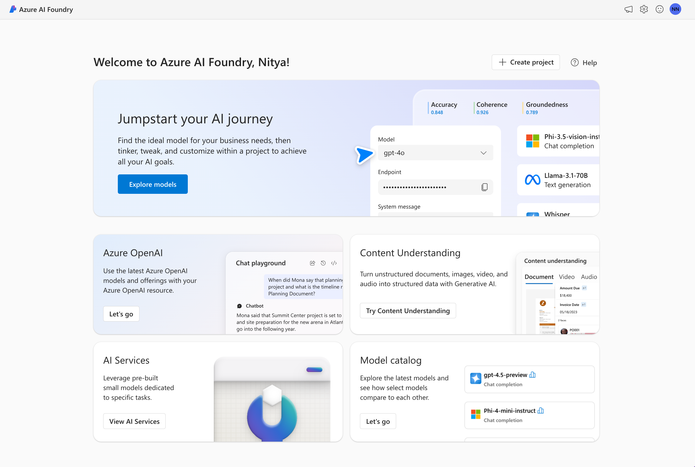

    1. **Next** - Click the _Create project_ button. You see a pop-up dialog like this.

        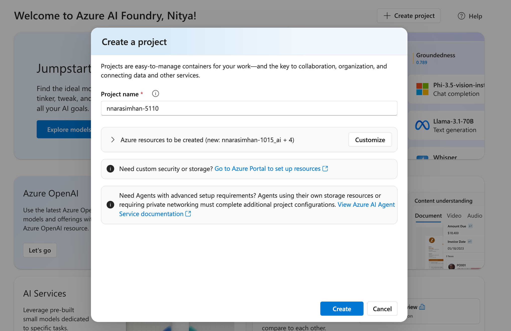

    1. **Next** - Click the _Customize_ button to customize project setup. First, click the _Create new resource group_ option to get this popup - and change resource group name to something easier to recall - e.g., `rg-AITOUR`. Next, make sure the region is **East US 2** (required for some evaluation features).

        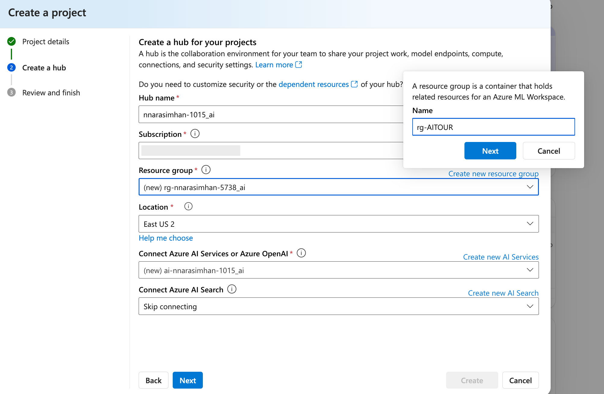

    1. **Next** - Click the _Create new AI Search_ option and fill in an easy-to-recall name for the Azure AI Search service e.g., `lab334-search`. Click **Next** to save changes back to the original dialog.

        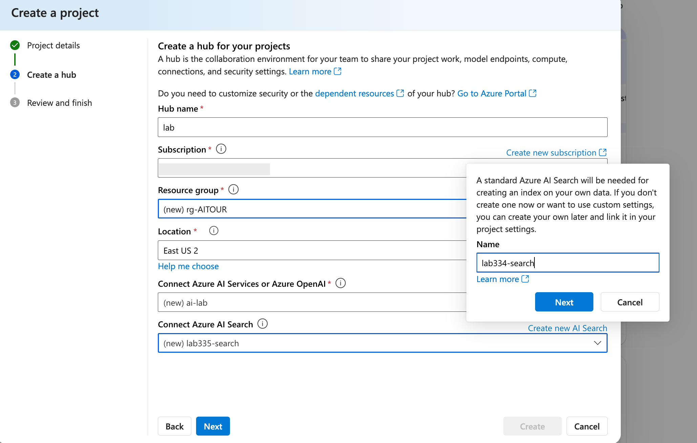

    1. **Next** - Make other name changes to make the related resources easier to locate later. _I used `lab334-` as a prefix for all resources in this example. **Click Next when done, to move to Review and Finish**.

        

    1. **Next** - You will be given a chance to confirm the settings. Once you do so, the workflow will create the relevant resources and update the dialog in real time to indicate completions. _This process takes a few minutes_.

        

    1. **Finally** - Click the listed project for details. You should be taken to a page like this in a new tab. **Leave this tab open** - we'll use the highlighted sections to configure environment variables later.

        

    1. Your Azure AI Project is ready! ✅

---

## 4. Review: Model Deployments

!!! info "In this step, uou'll setup and review AI model deployments for the lab"

=== "I AM A SESSION ATTENDEE"

    !!! quote "GOOD NEWS: Your pre-provisioned subscription has models deployed. Just review it." 

    1. In the Azure AI project page sidebar - click on **Models + Deployments**.  You should see:

        

    1. Verify that you see **three deployments**: `gpt4, gpt-4o-mini, text-embedding-ada-002`

    1. Your Azure AI Project model deployments are ready! ✅

=== "I AM A SELF-GUIDED LEARNER"   

    !!! quote "CAUTION: Your have to deploy the models yourself. Let's get that done!"

    1. In the Azure AI project page sidebar - click on **Models + Deployments**.  You should see:

        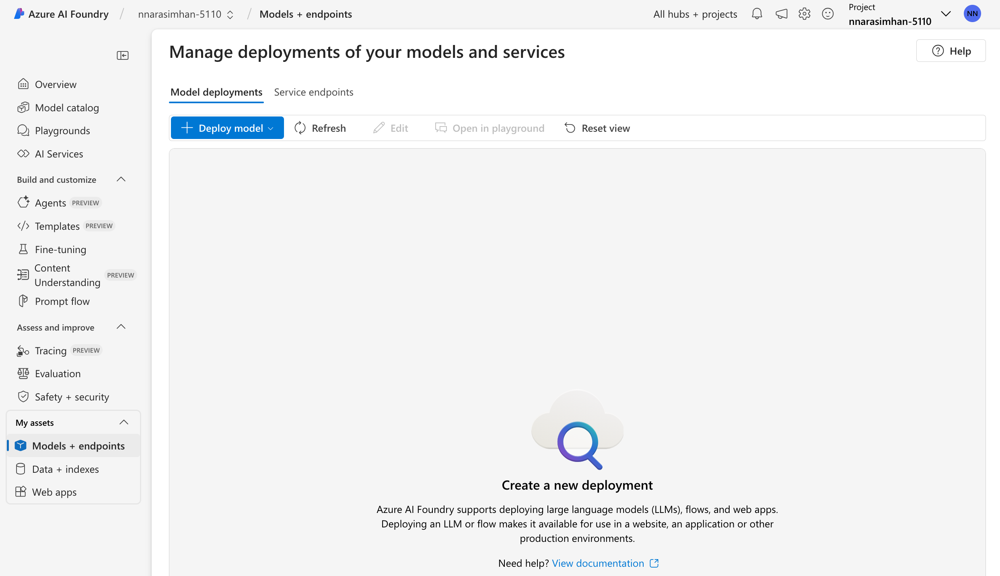

    1. Click **Deploy Model** to get the selection dialog below. Search for `text-embedding-ada-002` as shown. _This is our embedding model for use with the search service_.

        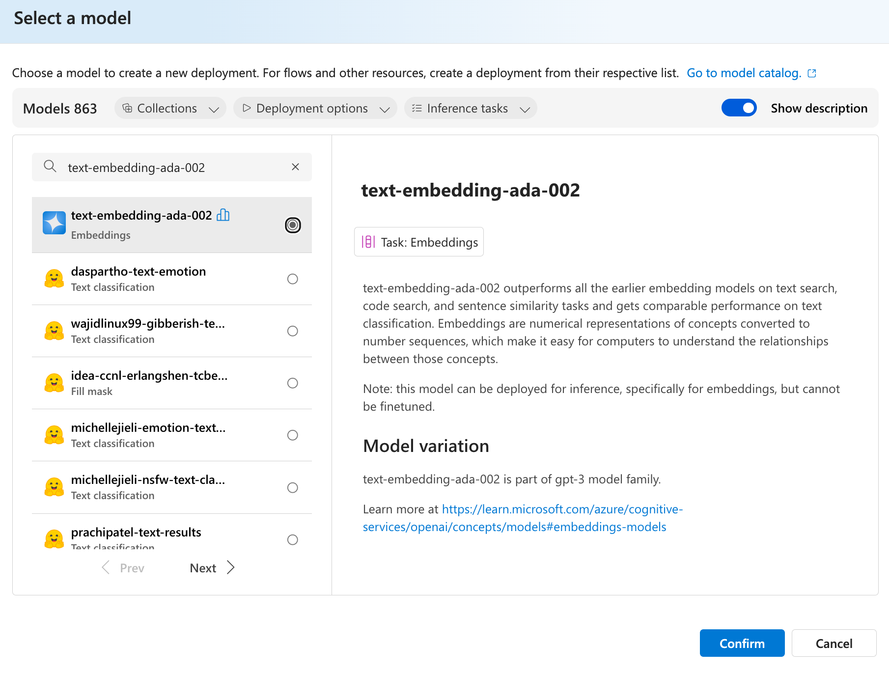

    1. Click **Confirm** - you wil get this dialog. You can review and make changes if needed. Click **Deploy** - _this should complete deployment within a few seconds_.

        

    1. You will now see the depoloyed model page as shown below.

        

    1. Click the back arrow to return to the previous page. **Repeat the process** with `gpt-4o-mini`. _This is your chat model_.

        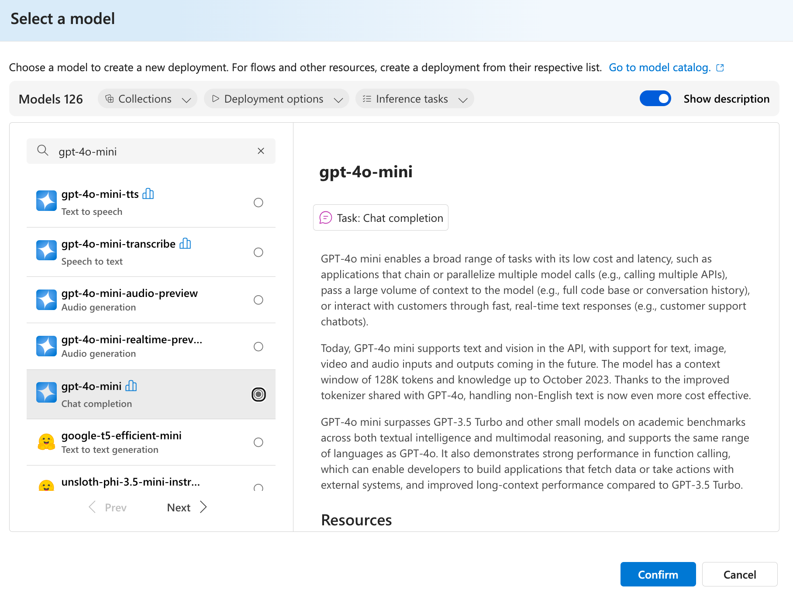

    1. Click the back arrow to return to the previous page. **Select the `gpt-4o`** for deployment next. This is your evaluation model_.

        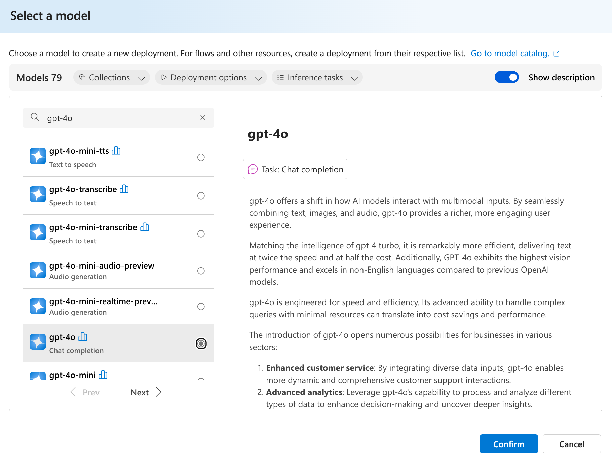

    1. **Important: Change its name before deploymnent** - delete `gpt-4o` and use `gpt4` in the _Deployment name_ field. This is just a convenience to match pre-provisioned path.

        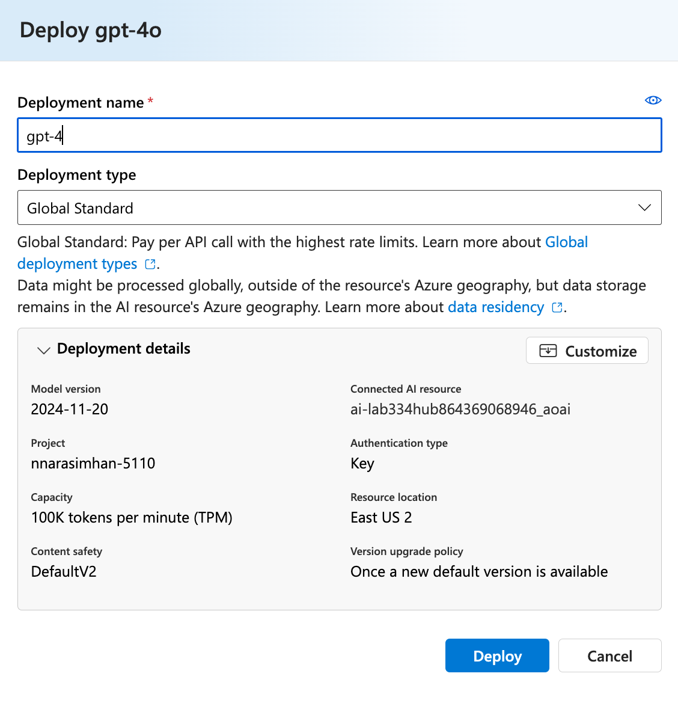

    1. Click on the model to see its details page. You should see something like this. 
        - Hover over the *Endpoint* link to see the URL details as shown below.
        - **Note the API Version** - we'll use that later.

            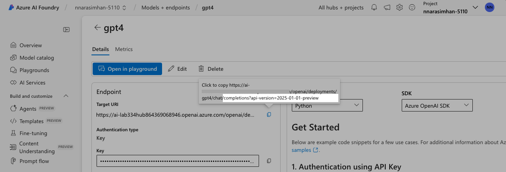

    1. Return to the **Models + Deployments** page by clicking option in sidebar.

        1. A _gpt-4o-mini_ model (with name `gpt-4o-mini`) - _this is your chat model_.
        1. A _gpt-4o_ model (with name `gpt4`) - _this is your judge model_.
        1. A _text-embedding-ada-002_ model (with same name`) - _this is your search model_.

            

    1. Your Azure AI Project model deployments are ready! ✅


---

## 5. Configure Azure AI Search

!!! info "In this step, you'll complete the final step required to setup your search index"

    - [X] Your Azure AI Foundry project is ready - has a search service
    - [X] Your Azure AI model deployments are ready - has an embeddings model
    - [ ] Your Azure AI search index is ready - has index created with your data

**First, we configure the resource in the Azure portal**.
    
1. Visit the [https://portal.azure.com](https://portal.azure.com) - sign in with the same Azure account.
1. Click the "Resource Groups" option - you will find a default resource group listed, as shown.
            
    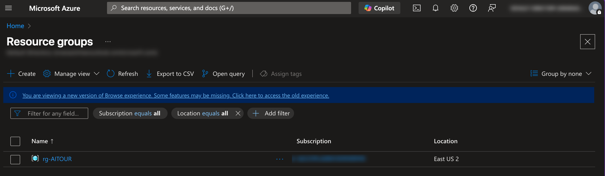

1. Click to view resource group page. Click the search service resource in that list.
            
    
    
1. In the search resource details page, click **Settings > Keys** in the sidebar. 
    - Select the **Both** option in the API Access Control panel. 
    - You should see a dialog pop up - click "Yes" to confirm the change.
            
    
    
     - [X] Your Azure AI Search is ready for index creation!
    
---

## 6. Configure Env Variables

!!! info "In this step, you'll configure environment variables for local development"

To populate search indexes from code, we need to set some environment variables. **We will also need additional environment variables for the evaluation labs** - so let's get that done now.

1. Return to the GitHub Codespaces tab. Run this command in VS Code Terminal:

    ```bash title="" linenums="0"
    cp .env.sample .env
    ```

1. Open the new `.env` file in your VS Code editor. It should look like this.

    ```text title="" linenums="0"
    # Azure Open AI
    AZURE_OPENAI_ENDPOINT=            # Format: "https://aoai-XXXX.openai.azure.com/"
    AZURE_OPENAI_API_KEY=             # Format: string of numbers
    AZURE_OPENAI_DEPLOYMENT="gpt-4o-mini"
    AZURE_OPENAI_API_VERSION="2025-01-01-preview"

    # Azure AI Foundry project
    AZURE_AI_CONNECTION_STRING=        # "REGION;SUBSCRIPTION-ID;RESOURCEGROUP;AIPROJECT"

    # Populate data
    COSMOS_ENDPOINT=                   # "https://cosmos-contoso-xxxx.documents.azure.com:443/"
    AZURE_SEARCH_ENDPOINT=             # "https://srch-xxx.search.windows.net"

    #GitHub
    GITHUB_TOKEN=                      # "github_pat_XXXXXXXXXXXXXXXXXXXX"
    ```

1. **Populate Azure OpenAI Variables**. Let's return to the Azure AI project details tab. You should see something like this. Pay attention to the red boxes in the image below.

    

    - [X] Set `AZURE_OPENAI_ENDPOINT_ - to value in Azure OpenAI endpoint red box
    - [X] Set `AZURE_OPENAI_API_KEY - to value in API key red box
    - [X] Set `AZURE_AI_CONNECTION_STRING_ - to value in Project connection string red box

1. **Confirm pre-filled variables**. Click the **Models + Deployments** option in sidebar.
    - [X] `AZURE_OPENAI_DEPLOYMENT_ - verify you have deployed model called "gpt-4o-mini"
    - [X] `AZURE_OPENAI_API_VERSION - click deployed model, hover over URL to see api version
    
    

1. **Update search endpoint**. Return to the Azure Portal page where search resource was open.
    - [X] Set `AZURE_SEARCH_ENDPOINT_ - to the "Uri" value in the **Essentials** panel

    

!!! success "YOU DID IT!! You development environment is set! Let's move to code"

---

## 7. Populate Search Index

!!! info "In this step, you'll use a code-first approach to populate the search index"

We'll do this in 2 steps - first, run a script to give the user identity access to the search service. Then, run a notebook to upload the data and create the index. Let's get started.


1. Switch to the GitHub Codespaces tab, run this command in VS Code terminal. It takes a couple of minutes to complete. _You can now write to the search resource from code_.

    ```bash title="" linenums="0"
    ./scripts/update-search-roles.sh
    ```

1. Open the `data/product_info/create-azure-search.ipynb` notebook in the editor. This contains the code to populate the search index with data.
    - Select Kernel - use the default Python environment. 
    - Clear outputs - then **Run All** to populate the search index with data.

2. Verify index was created by returning to the Azure portal tab with search resource open.
    - Click on **Search explorer** - you see a `contoso-products` search index. 
    - Click "Search" and you should see the product index populated as shown.

        

    - Try a test query `something to eat on`. It should return a valid product using hybrid search with semantic ranking.

        

!!! success "Your development environment is all set for labs!"

---

## 6. Next Steps

!!! quote "CONGRATULATIONS: Your Azure AI project and local dev environment are ready!"

    Here's what you accomplished!

    - [X] Setup GitHub Codespaces environment and logged into Azure
    - [X] Setup Azure infrastructure and customized resources as needed
    - [X] Validated Azure AI Foundry project and model deployments
    - [X] Configured environment variables in GitHub Codespaces for code use
    - [X] Populated the search index with our data (Contoso Outdoors products)
    
    **Now, we just work on evaluation labs, one at a time!!**