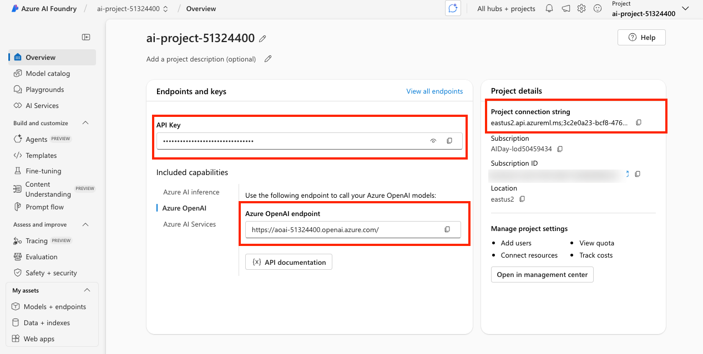

# 1. Dev Environment


!!! quote "By the end of this section you should have"

    - An Azure subscription provisioned with required resources
    - A GitHub Codespaces environment configured with env variables
    - Validated both with a set of simple checks

    - **DURATION:** 
        - 5 mins (In-Venue) - uses pre-provisioned resources
        - 20 mins (Self-Guided) - to also provision resources

---

## Before You Begin

_We designed this lab to be used at Microsoft Build (with a pre-provisioned Azure subscription) or at home (with your own Azure subscription). Just pick your path to get the right instructions._


!!! info "ARE YOU A MICROSOFT BUILD ATTENDEE OR A SELF-GUIDED LEARNER?"

    === "I AM A SESSION ATTENDEE"

        - [X] Yes, I am currently at Microsoft Build. 
        - [X] I'll use a Skillable-provided Azure subscription**

    === "I AM A SELF-GUIDED LEARNER"

        - Yes, I am working on this at home. 
        - I'll be using my own Azure subscription**

---

## 1. Login with Azure CLI

_You are currently running in a GitHub Codespaces environment. Let's authenticate to Azure so we can access resources from code._

1. Open the VS Code terminal and run this command - then follow instructions.

    ```bash title="" linenums="0"
    az login --use-device-code
    ```

1. You will be prompted to enter Azure credentials (username and password). Use the right credentials as described below:

    === "I AM A SESSION ATTENDEE"

        - [X] Switch to the browser tab with the Skillable VM.
        - [X] Use the Azure credentials provided in the instructions panel there.

    === "I AM A SELF-GUIDED LEARNER"

        - [X] Use your own Azure credentials to complete this login step.

    Return to the VS Code terminal - **you should be logged in successfully.** 

---

## 2. Setup Env Variables

_Now, let's make sure our GitHub Codespaces environment can talk to these resources by setting the relevant environment variables. Return to the GitHub Codespaces tab now._.

1. Run this command to create the `.env` file

    ```bash title="" linenums="0"
    cp .env.sample .env
    ```

1. Open the `.env` file created in the editor. It should look like this: 

    ```text title="" linenums="0"
    # Azure Open AI
    AZURE_OPENAI_ENDPOINT=
    AZURE_OPENAI_API_KEY=
    AZURE_OPENAI_DEPLOYMENT="gpt-4o-mini"
    AZURE_OPENAI_API_VERSION="2025-01-01-preview"

    # Azure AI Foundry project
    AZURE_AI_CONNECTION_STRING=

    # Needed For Lab 0: Simulator
    AZURE_SEARCH_ENDPOINT=
    AZURE_SEARCH_API_KEY=
    AZURE_SEARCH_INDEX_NAME="contoso-products"

    # Needed For Lab 1 on: Evaluator
    LAB_CHAT_MODEL="gpt-4o-mini"
    LAB_JUDGE_MODEL="gpt-4"
    ```

    **We'll fill these values in, next.**

---


## 3. Configure Azure AI Project

_Your Azure AI Foundry project is the main resource for developing and managing your generative AI application. Let's review it and configure our environment variables._


=== "I AM A SESSION ATTENDEE"

    - Visit [https://ai.azure.com](https://ai.azure.com) - login with the same Azure account.
    - You'll see a pre-provisioned Azure AI project listed - click it to get the page below. 
    - Now use the highlighted sections to populate _.env_.
        - [X] Set `AZURE_OPENAI_API_KEY` in .env - to API key value
        - [X] Set `AZURE_AI_CONNECTION_STRING` in .env - to Project connection string value
        - [X] Select the `Azure OpenAI` tab under **"Included capabilities"**
        - [X] Set `AZURE_OPENAI_ENDPOINT` in .env - to Azure OpenAI endpoint value


    

=== "I AM A SELF-GUIDED LEARNER"

    - Visit [https://ai.azure.com](https://ai.azure.com) - login with the same Azure account.
    - You will see a **Create project** button - with no pre-existing projects.
    - Create a new Azure AI project [using a tutorial like this](https://learn.microsoft.com/en-us/azure/ai-foundry/tutorials/copilot-sdk-create-resources?tabs=macos).
    - Deploy 3 models (`gpt-4o-mini`, `gpt-4`, and `text-embedding-ada-002`) 
    - Add an Azure AI Search service resource (during setup, for convenience)
    - The created project overview looks like this. **Leave this tab open** - we'll use it later

         


---

## 4. Configure Azure AI Search

_We use Azure AI Search indexes for simulating datasets, and exploring manual evaluation in the portal. To support this, we need to allow both types of API access. Let's do that, next_.
  
1. Open a new browser tab - visit [https://portal.azure.com/#browse/resourcegroups](https://portal.azure.com/#browse/resourcegroups)
1. Login with the same Azure account - click the `rg-AITOUR` entry to get the list of resources
1. Click the **Search service** resource - click **Settings** then **Keys** in sidebar
1. In the **API Access Control** page below - click **Both**, then confirm "Yes" in pop-up
            
    
    
1. Now let's populate related _.env_ variables
    - [X] Set `AZURE_SEARCH_API_KEY` in .env - to "Primary Key" from this page
    - [X] **Switch to the Overview** page for the Search service to see details
    - [X] Set `AZURE_SEARCH_ENDPOINT` in .env - to "Url" value (top right)

**Your environment variables are set!**