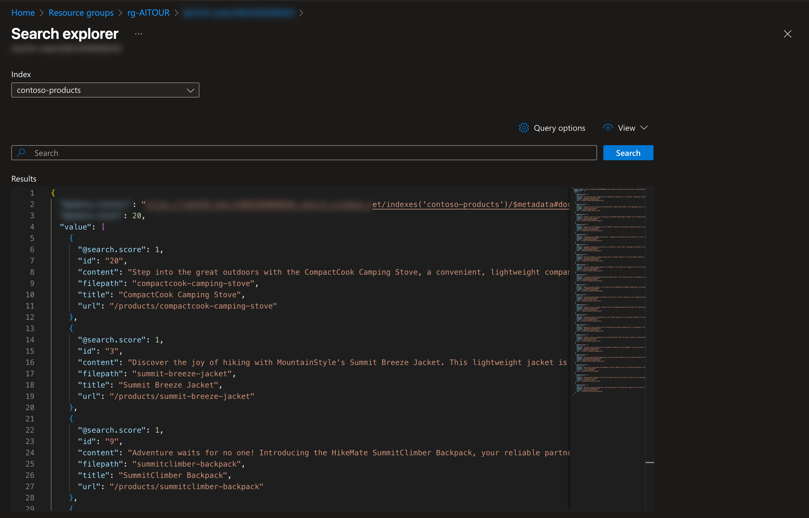

# Lab 0: Add Your Data

!!! quote "In this lab, you will learn to add your data to create a search index."

    By the end of this lab, you should be able to:

    - [X] Populate your own data in the search index
    - [X] Understand how search index works with a simple test

---

## 1. Why Search Index?

The main purpose of the search index is to support the ability to ground your model responses in knowledge _retrieved from your data_. In this lab, we'll run a notebook that populates the Azure AI Search resource with a default search index called `contoso-products`. 

We can then use this index in two exercises:

1. **Synthetic Dataset Generation** - using the Simulator with a search index
1. **Manual Evaluation (in Portal)** - with, and without, grounding context

---

## 2. Update Access Roles

_We need our user identity to have specific access roles to the search resource - let's fix that._

1. Return to the GitHub Codespaces environment (browser tab)
1. Run this command in the VS Code terminal - it completes within a minute or so.

    ```bash title="" linenums="0"
    ./scripts/update-search-roles.sh
    ```

---

## 3. Populate The Index

_Now that we have access, we just need to run the notebook to create a search index with that name, and populate the data from our local files. Let's do that, next!_.

1. Open the `data/product_info/create-azure-search.ipynb` notebook in editor.
    - Select Kernel - use the default Python environment (see: `3.12.10`)
    - Click "Clear Outputs", then "Run All" - this takes 1-2 minutes to complete
    - ✅ | You should see search index created with 20 records

1. Verify the product search index was created:
    - Return to Azure Portal browser tab - it should be open to the Search service page:
        
    - Click on **Search explorer** - you see `contoso-products` as shown. Click "Search" to see default search results for an empty query. It should look like this:
        

---

## 3. Test The Index

- Try this search query. Then look at the `value` field for the most relevant result. You should see a valid product with "Dining Table" in the name. _This shows basic keyword search works_.

    ```bash title="" linenums="0"
    Dining Table
    ```

- Try this new search query. Then look at the `value` field for the most relevant result. You should also see a valid product with "Dining Table" in the name. _This is an example of vector search with (semantic ranking) in action_.

    ```bash title="" linenums="0"
    Something to eat on
    ```

    Your results may look something like this: 

    


**Your search index is ready - and you saw semantic search in action!**

---

**Next**: Let's get started with the labs!